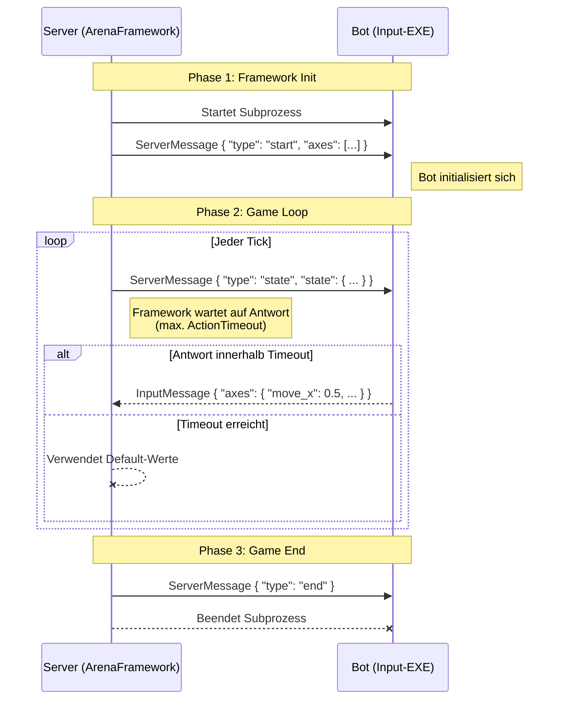

# ArenaFramework

Go-Library für die Verwaltung von Input-EXEs (Bots, Spieler, KI) in austauschbaren Spielen.

## Konzept

Das Spiel importiert `pkg/arena` als Library. Die Arena startet alle `.exe`-Dateien aus einem Verzeichnis als Subprozesse und kommuniziert über **stdin/stdout-Pipes** mit **JSON** (NDJSON - Newline Delimited JSON).

Input-EXEs können in jeder Sprache geschrieben werden. Der Kontrakt wird über ein JSON-Schema definiert (`docs/bot-schema.json`).

## Quickstart

```bash
# Build
go build ./...

# Beispiel: Tic-Tac-Toe mit 2 RandomBots
go build -o bin/tictactoe.exe ./cmd/tictactoe
go build -o bin/randombot.exe ./cmd/randombot

# Inputs-Verzeichnis vorbereiten
mkdir bots/inputs
cp bin/randombot.exe bots/inputs/player1.exe
cp bin/randombot.exe bots/inputs/player2.exe

# Spiel starten
./bin/tictactoe.exe
```

## Nutzung im eigenen Spiel

```go
package main

import (
    "time"
    "github.com/BotBattleArena/ArenaFramework/pkg/arena"
)

func main() {
    a, _ := arena.New(arena.Config{
        InputDir:      "./bots/inputs",
        ActionTimeout: 5 * time.Second,
        Axes: []arena.Axis{
            {Name: "move_x"},
            {Name: "move_y"},
            {Name: "shoot"},
        },
    })

    a.OnConnect(func(p arena.Player) {
        // Input verbunden...
    })

    a.Start()
    defer a.Stop()

    // Game Loop
    for {
        state := []byte(`{"position": [0, 0]}`) // Dein serialisierter State
        responses := a.RequestAxes(state, 5*time.Second)
        // responses["player1"]["move_x"] == 0.5
        // responses["player1"]["shoot"]  == 1.0
    }
}
```

## Bot schreiben

Bots sind separate EXEs die über stdin/stdout kommunizieren. Protokoll:

1. **Wire-Format**: [NDJSON](https://github.com/ndjson/ndjson-spec) (Jede Nachricht ist ein JSON-Objekt gefolgt von einem Newline-Charakter `\n`).
2. **Schema**: Siehe `docs/bot-schema.json`
3. **Ablauf**: `ServerMessage` von stdin lesen → `InputMessage` auf stdout schreiben

**Communication Workflow:**



Siehe `cmd/randombot/main.go` als Referenz oder `docs/bot-guide.md` für eine ausführliche Anleitung.

## Ordnerstruktur

```
pkg/arena/          Öffentliche Library
internal/           Private Implementierung
cmd/                Beispiel-Executables
docs/               Dokumentation
```

## Submodule
Submodule hinzufügen:
```bash
git submodule add <repository-url> <path>
```

